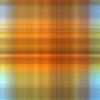

[](https://github.com/nurlantulemisov/imagecompression/actions/workflows/go.yml)
[](https://coveralls.io/github/nurlantulemisov/imagecompression)
## SVD image compression

An implementation image compression using SVD decomposition on Go

### Built With

* [Go 1.17]()
* [Gonum](https://github.com/gonum/gonum)

## Compression examples

Header | Image
-------|-----------------------------------
| Original    | 
| Ratio 10%   | |
| Ratio 50%   | 
| Ratio 80%   | |
| Ratio 99%   | |

## Getting Started

To get a local copy up and running follow these simple steps.

### Installation

1. Install vendor
   ```sh
   go get -u github.com/nurlantulemisov/imagecompression
   ```

<!-- USAGE EXAMPLES -->

### Simple usage

```Go
file, _ := os.Open("tmp/image.jpeg")
img, _ := jpeg.Decode(file)

compressing, _ := image_compression.New(50) // create with percent ratio
compressingImage := compressing.Compress(img)
```

<!-- CONTRIBUTING -->

## Contributing

Contributions are what make the open source community such an amazing place to learn, inspire, and create. Any
contributions you make are **greatly appreciated**.

1. Fork the Project
2. Create your Feature Branch (`git checkout -b feature/AmazingFeature`)
3. Commit your Changes (`git commit -m 'Add some AmazingFeature'`)
4. Push to the Branch (`git push origin feature/AmazingFeature`)
5. Open a Pull Request

## Roadmap

1. Compression of grayscale images
2. Provide Frobenius norm


<!-- CONTACT -->

## Contact

Tulemisov Nurlan - [@NurlanTulemisov](https://twitter.com/NurlanTulemisov)

Email - nurlan.tulemisov@gmail.com

Project Link: [https://github.com/nurlantulemisov/imagecompression](https://github.com/nurlantulemisov/imagecompression)
